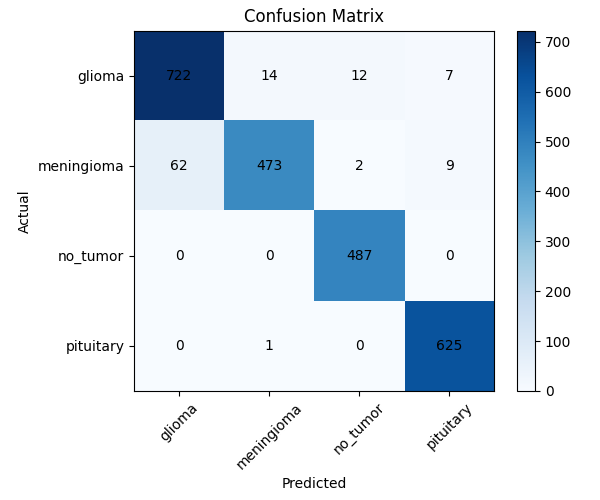

# Brain Tumor MRI Classification Using Convolutional Neural Networks

## Project Overview
This project implements a deep learning–based image classification system to detect brain tumors from MRI images. A Convolutional Neural Network (CNN) is trained to classify MRI scans into tumor and non-tumor categories, helping demonstrate the application of deep learning in medical image analysis.

## Objective
The objective of this project is to build and evaluate a CNN model that can automatically identify the presence of brain tumors from MRI images, which can assist in early diagnosis and medical decision support.

## Dataset
The dataset consists of brain MRI images organized into training and validation directories. Each image belongs to one of the following classes:
- Tumor
- No Tumor

The dataset is structured as:
```
data/
├── train/
│ ├── Tumor/
│ └── No_Tumor/
└── val/
├── Tumor/
└── No_Tumor/
```

> **Note:** The dataset is not included in this repository due to size limitations.  
> Please place the dataset inside the `data/` directory before running the notebook.

## Project Structure
```
Brain-Tumor-MRI-Classification/
│── Brain_Tumor_MRI_Classification.ipynb
│── README.md
│── requirements.txt
│── results/
│ ├── confusion_matrix.png
│ └── classification_report.txt
│── data/ (not included)
```


## Methodology
- Image loading and resizing using TensorFlow utilities  
- Data augmentation and normalization  
- CNN model design with convolutional, pooling, and dense layers  
- Model training using categorical cross-entropy loss  
- Performance evaluation using confusion matrix and classification report  

## Model Architecture
The CNN architecture includes:
- Convolutional layers with ReLU activation
- MaxPooling layers for dimensionality reduction
- Fully connected (Dense) layers
- Softmax activation for classification

## Evaluation Metrics
The model performance is evaluated using:
- Accuracy
- Precision
- Recall
- F1-score
- Confusion Matrix

## Results
- The trained CNN model achieves good classification performance on the validation dataset.
- The confusion matrix visualization is available below:



- A detailed classification report (precision, recall, F1-score) is available in:
`results/classification_report.txt`


## How to Run the Project
1. Clone the repository  
2. Install dependencies using:
`pip install -r requirements.txt`
3. Place the dataset inside the `data/` directory  
4. Open `Brain_Tumor_MRI_Classification.ipynb` in Jupyter Notebook or Google Colab  
5. Run all cells sequentially  

## Limitations
- Performance depends on dataset size and quality  
- The trained model file is not included due to size constraints  
- Limited generalization to unseen MRI datasets  

## Future Improvements
- Apply data augmentation to improve generalization  
- Use transfer learning models such as ResNet or MobileNet  
- Deploy the model as a web or desktop application  

## Author
Sanskriti Singh

